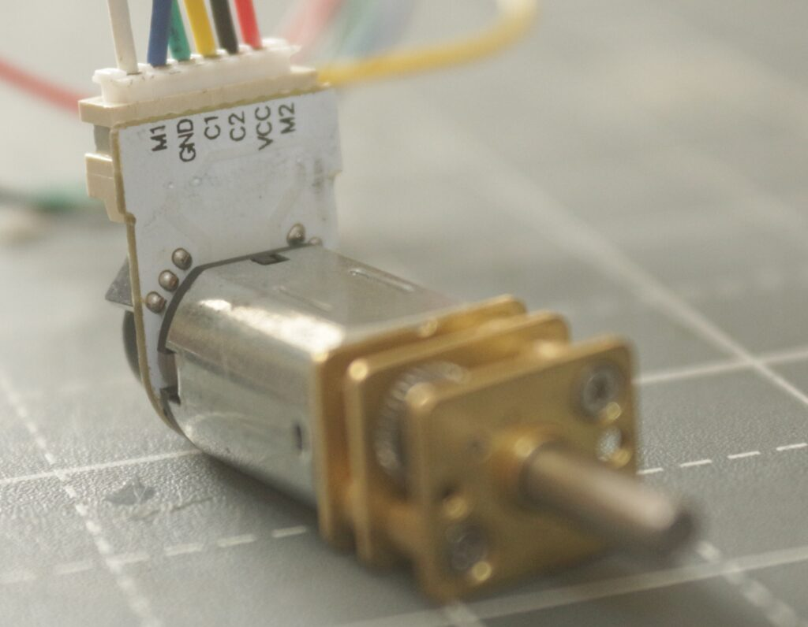

# Jetbot_ROS

Differential wheeled robot based on Jetson Orin Nano Dev kit.

## How to set the jetpack

## Install ROS 2 foxy

https://docs.ros.org/en/foxy/Installation/Ubuntu-Install-Debians.html

## How to set up Jupyter Lab 4 and jupyter_clickable_image_widget (neccesary for collect data script)
```
pip install jupyterlab==4.0.10 ipywidgets
curl -fsSL https://deb.nodesource.com/setup_20.x | sudo -E bash -
sudo apt install -y nodejs
sudo npm install -g yarn
git clone https://github.com/jaybdub/jupyter_clickable_image_widget
cd jupyter_clickable_image_widget
cd js
yarn install
yarn add @jupyter-widgets/controls (maybe before?)
yarn run build:prod
cd ..
pip install .
jupyter lab build
```

## Connections:

<p align="center">



</p>

| Jetson Orin Nano | Motor Driver | Encoder L | Encoder R |
|------------------|--------------|-----------|-----------|
| 1                | 3V3          |           |           |
| 2                |              | VCC       |           |
| 3                | SDA          |           |           |
| 4                |              |           | VCC       |
| 5                | SCL          |           |           |
| 6                | GND          |           |           |
| 9                |              |           | GND       |
| 11               |              |           | C1        |
| 12               |              |           | C2        |
| 14               |              | GND       |           |
| 15               |              | C1        |           |
| 16               |              | C2        |           |
|                  | M1           | M1-M2     |           |
|                  | M2           |           | M1-M2     |


