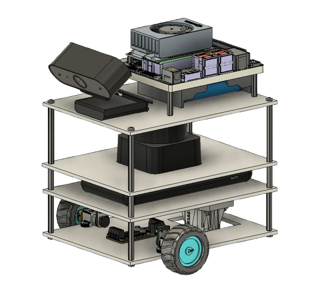

# JETROS

Differential wheeled robot based on Jetson Orin Nano Dev kit.

  

## Bill of Materials
| Component                                  | Link               |
|--------------------------------------------|--------------------|
| NVIDIA Jetson Orin Nano Dev Kit            | https://developer.nvidia.com/buy-jetson?product=all&location=CA                    |
| Waveshare UPS Module for Jetson Orin       | https://www.waveshare.com/ups-power-module-c.htm                   |
| 21700 Li battery x3                        | https://www.amazon.ca/Rechargeable-21700genuine-Batteries-Flashlight-Headlamp/dp/B0BPNGQ6N8/ref=sr_1_5?crid=1JD1CX1JGNQRR&dib=eyJ2IjoiMSJ9.j33BkcdIaQ69GNlVkE9HQagf7ccdUdSIBWeQ8hRA-muGtQS0B7M5oX3y5_iyBxY0F96UtEvod7rHWRfGD6SaE0EGE8VyhIxB2o_lQ6AhlznqCFVLniC3H1EIo8LYDdv_q0j_g62E8NhIifcwb_z2ADOBWB0prOjehXqJYbahp3d5dq1qj7CK9VOO8lLNdE-xnyvg6eUGmy1nUxmf397GHqz5oDJrG6f8hlML6aBgbU_CJbhWzWNaPiDE5A3eNYCCf2i70r14GkLfuA5wafJKb3ZCU6kvRelxS66EnWSzILs.lMFfoPm4czyzZgvqt4Z-n_ubEFJ3s4MoBHhm9z59o3s&dib_tag=se&keywords=21700+Li+battery&qid=1747420415&sprefix=21700+li+battery+%2Caps%2C72&sr=8-5                   |
| Slamtec RPLIDAR C1                         | https://www.amazon.ca/ZICZNT-scanning-Positioning-Navigation-Avoidance/dp/B0DDKZV8HZ                   |
| Akyta AKT-N5-1 HD Webcam                   | https://www.amazon.ca/Desktop-with110-Degree-Digital-Microphone-Recording/dp/B07Z2GZTYY/ref=sr_1_2_sspa?dib=eyJ2IjoiMSJ9.pXeG26BTC5hvFJ40Ct2PhaFX4HutAoiicXlK811VYzKPDkw9C7hKWKjAtYA9qXG6E2Y-nb9XZDwy3LrC5s7bS0bC-1IXs6iu9vnR4Ysq6F9xQKCA3Hl1F1GdtEvFxKsjH0swUyCYHS51I8Z6yXrJiqjCCSG2PTz1ZDnCY69iqUKmfvBzJzODeViOflWfKkzodqKcx1N0-cmGndViQBaTzQADP-gzqSFkNssngn3knH5gSWfPr7-UrPR2ySG8ddfh344lwGLNXQuElL6RRHr0kz47Xkw-KCitanbHAPlFJeQ.k5V0GyATvKPSM1bxG-0Fjj7GKxNpIYP_dT9ij5JJ1wU&dib_tag=se&keywords=Akyta+AKT-N5-1+HD+Webcam&qid=1750630632&sr=8-2-spons&sp_csd=d2lkZ2V0TmFtZT1zcF9hdGY&psc=1                   |
| GA12-N20 DC Encoder Motor x2               | https://www.amazon.ca/Reduction-Rotating-GA12-N20-Encoder-Permanent/dp/B0CC55GCMM?th=1                   |
| Adafruit FeatherWing Motor Driver          | https://www.adafruit.com/product/2927?srsltid=AfmBOooZTwYZpVQFFOb1u36j2i_Kcq3z-mYKjlnS9TZ4RGsDC-pft_L8                   |
| AsperX Power Bank 10000mAh                 |  https://www.amazon.ca/AsperX-10000mAh-Portable-External-iPhone14/dp/B09JBKDSP9/ref=sr_1_1_sspa?crid=22GXAOTYHITJB&dib=eyJ2IjoiMSJ9.t9cH1wVDvBZfc0hDCgEYVbW3N2wX-g-O2n2kvwOznMmUY_vICsrPcjRSZLYLDFm8L2TVz58q17S9BX4Fd7AXymjsxg_LI6RO-kzzvvakTUkyqvfjkOtOK7zqeNC5m1iVOlXyQGxN57ni6lwQPJWLRniPZzygxbEt3WBMgsHe1hwUBhZVxuIcUgtjPr6fDSTsOa4f-HzQzH52e-gRjA1b0asTm5zFAy2U7qDAKH1j4WXhaYexGRogsdHLP8L4x9plV-G1C0uDfCreNpePlJJCUEhnizWCslkD6GHNr5VgQmQ.n1hzhFdjfY5uuS8HVh1uz5VKTOl-B1H5ZJRDFHTWTBc&dib_tag=se&keywords=AsperX%2BPower%2BBank%2B10000mAh&qid=1751605608&sprefix=asperx%2Bpower%2Bbank%2B10000mah%2Caps%2C108&sr=8-1-spons&sp_csd=d2lkZ2V0TmFtZT1zcF9hdGY&th=1                  |

## Recommended Workflow
To successfully follow this project, we suggest progressing in the following order:

🔧 env_setup/ – Environment setup (dependency installation, ROS 2 setup, Jetson configuration, etc.)

🛠️ physical_build/ – Physical build of the robot (3D printing files, assembly details, wiring, etc.)

