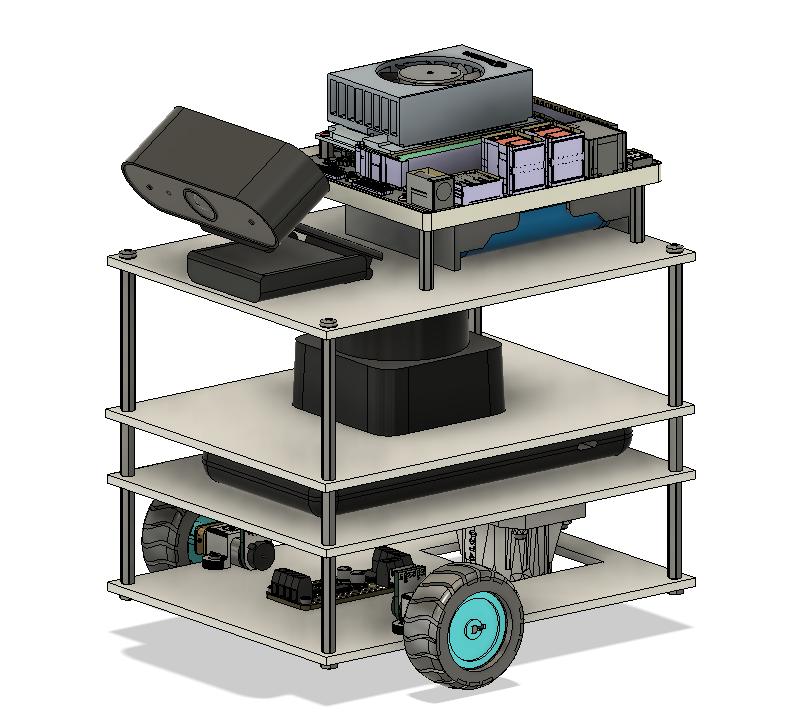
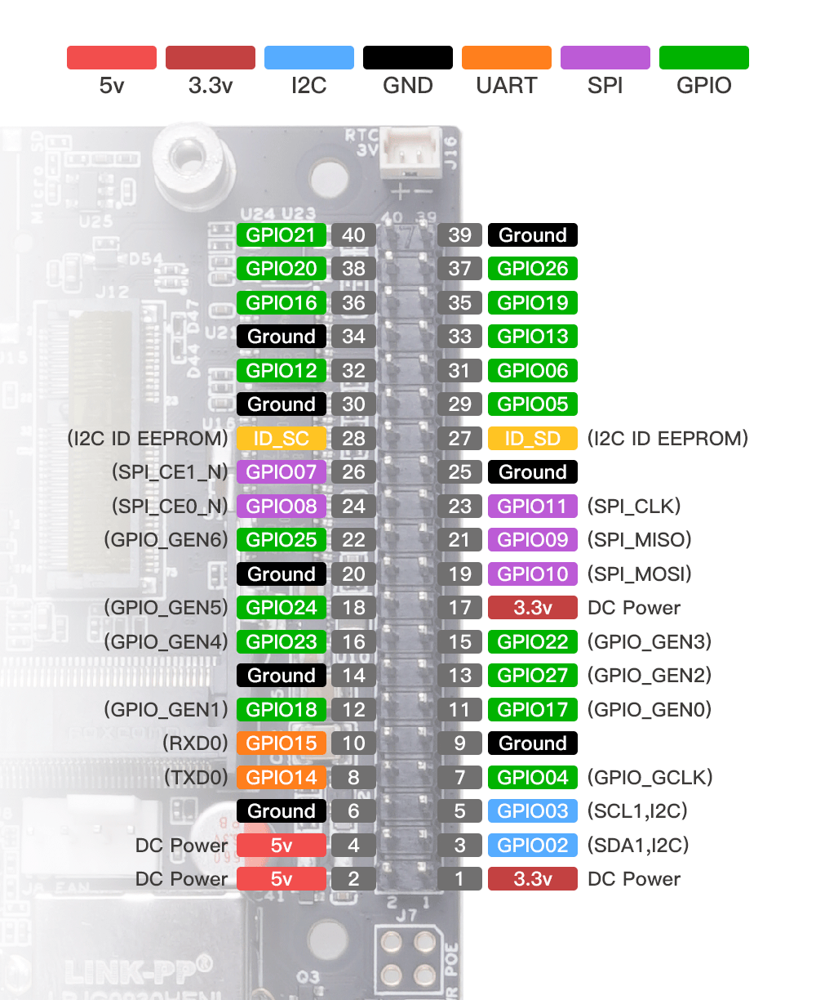
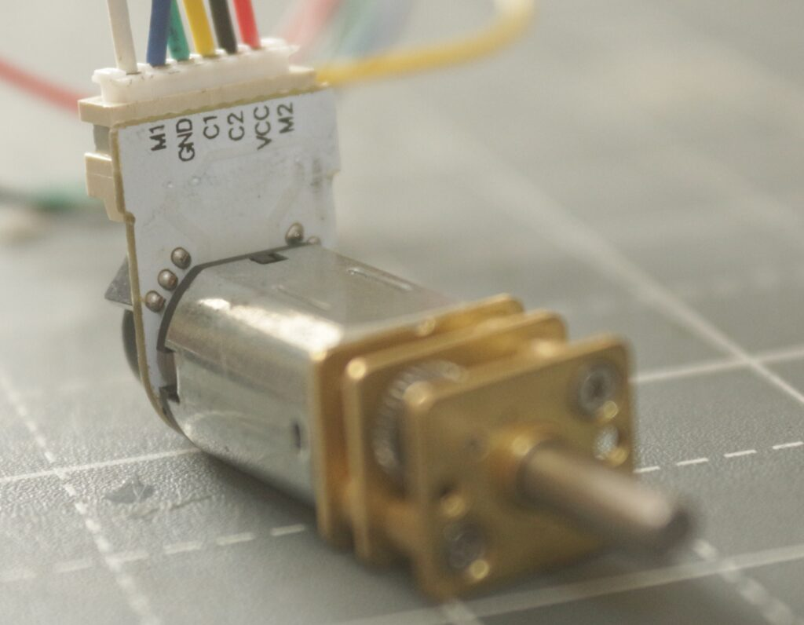
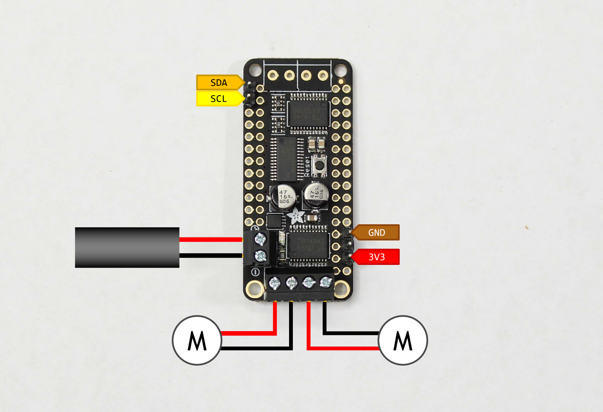

  

### Bill of Materials
| Component                                  | Link               |
|--------------------------------------------|--------------------|
| NVIDIA Jetson Orin Nano Dev Kit            |                    |
| Waveshare UPS Module for Jetson Orin       |                    |
| 21700 Li battery x3                        |                    |
| Slamtec RPLIDAR C1                         |                    |
| Akyta AKT-N5-1 HD Webcam                   |                    |
| GA12-N20 DC Encoder Motor x2               |                    |
| Adafruit FeatherWing Motor Driver          |                    |
| AsperX Power Bank 10000mAh                 |                    |

### Connections:

| Jetson Orin Nano | Motor Driver | Encoder L | Encoder R |
|------------------|--------------|-----------|-----------|
| 1                | 3V3          |           |           |
| 2                |              | VCC       |           |
| 3                | SDA          |           |           |
| 4                |              |           | VCC       |
| 5                | SCL          |           |           |
| 6                | GND          |           |           |
| 9                |              |           | GND       |
| 11               |              |           | C1        |
| 12               |              |           | C2        |
| 14               |              | GND       |           |
| 15               |              | C1        |           |
| 16               |              | C2        |           |
|                  | M1           | M1-M2     |           |
|                  | M2           |           | M1-M2     |
