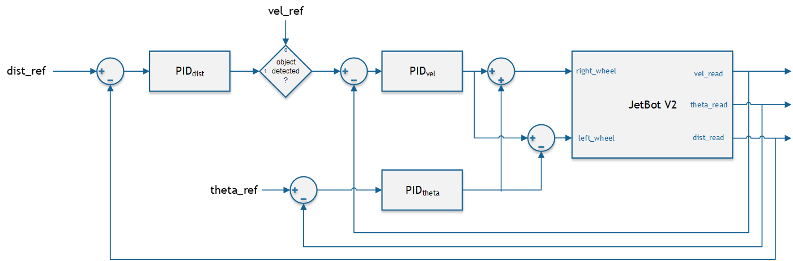
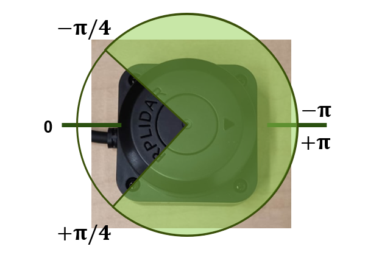

# ROS2 packages, GUI and more
This section contains all information related to the ROS 2 packages, beginning with the installation of necessary third-party dependencies, and then providing details about the jetros package.

### Diagram of the complete system:
<p align="center">
  
</p>

# Third-party packages and necessary changes

## Camera Node Package    
The package for the camera node can be found in the following GitHub repository:
```bash
https://github.com/ros-drivers/usb_cam
```
This package must be built from source, as we need access to its source files in order to make modifications.
The required modification is described below:
Navigate to the file located at:
```bash
ros2_ws/src/usb_cam/src/usb_cam_node.cpp
```
Find the following line:
```bash
const char BASE_TOPIC_NAME[] = "image_raw";
```
And change it to:
```bash
const char BASE_TOPIC_NAME[] = "/jetrosX/image_raw";
```
Where X is the ID of your robot. This ID must match the one used in the launch file of the jetros package.
After making the change, you must recompile the package for the modification to take effect.

## LiDAR Node Package
The package for the LiDAR node can be found in the following GitHub repository:
```bash
https://github.com/Slamtec/rplidar_ros/tree/ros2
```
Follow the instructions provided in the repository to compile and install the package.

Once installed, navigate to the file located at:
```bash
ros2_ws/src/rplidar_ros/src/rplidar_node.cpp
```
Find the following lines:
```cpp
this->declare_parameter<std::string>("topic_name", std::string("scan"));
this->get_parameter_or<std::string>("topic_name", topic_name, "scan");
```
And change them to:
```cpp
this->declare_parameter<std::string>("topic_name", std::string("/jetrosX/scan"));
this->get_parameter_or<std::string>("topic_name", topic_name, "/jetrosX/scan");
```
Where `X` is the ID of your robot. This ID must match the one used in the launch file of the `jetros` package.

After making the changes, you must recompile the package for them to take effect.

# jetros package
---

### Launch

This launch file is meant to initialize and run the full sensor and control stack for a robot in the jetros system. It also allows configuring the robot's ID and adjusting certain parameters of the LiDAR filter, such as the distance range and the angular sector in which the data is filtered. These settings are explained in more detail in the node section.

---

### Neural Network Node

This node, called steering_node, is responsible for processing images from a camera and generating coordinates corresponding to the center of the path. It uses a pre-trained neural network optimized with TensorRT to infer the steering direction from the images and publishes the result as a Twist message. Note that the model path must be updated to match the correct location of the .pth file on your system.

---

### Action Prioritizer Node

This node is responsible for determining the robot's velocity based on multiple inputs, including obstacle detection, object distance, and velocity references from another robot. It uses a PID controller to regulate the distance to an object when one is detected, adjusting the robot's speed accordingly.

The node prioritizes between autonomous behavior and inter-robot coordination depending on the current context. Its operation is triggered by a signal received on the /start topic, which acts as a global activation command.

---
### PID Controller Node

<table>
<tr>
<td width="40%">

</td>
<td width="60%">
<p>
This node implements two PID controllers to regulate the linear and angular velocities of a robot based on target and feedback values. It receives reference commands from the gui and compares them with actual velocity readings, computing control signals to be sent to the motors.
The linear and angular PID controllers run at a fixed rate, and their output is saturated to stay within motor limits.
</p>
</td>
</tr>
</table>

---
### Motor Controller Node

This node is responsible for converting velocity commands into low-level motor control signals.

---
### Lidar Filter Node

<table>
<tr>
<td width="40%">

</td>
<td width="60%">
<p>
The FilteredLidar node processes LiDAR sensor data, applying a filter based on configurable angles and distances to retain only the points within a specific region of interest. It then publishes a reduced scan to /jetros<ID>/filtered_scan, a boolean signal to /jetros<ID>/obj_det indicating whether an object is detected within the filtered area, and the distance to the closest object on /jetros<ID>/dist_read.
In the launch file, the parameters can be configured. The distance must be specified in meters, and if the LiDAR is oriented with the arrow pointing forward, π will always be the maximum angle and the minimum will be somewhere between 0 and π, creating a symmetric sweep as shown in the image. If a non-symmetric range is desired, the node must be modified accordingly.
</td>
</tr>
</table>

---
### Odometry Node

This node calculates the robot’s odometry by using its kinematics and the velocity data received from the wheel encoders. It translates the encoder readings into the robot’s velocity and publishes this information for use by other components in the system.

---
### Encoder R and L Nodes

These nodes read the signals from the left and right wheel encoders, count the pulses to determine wheel rotation, and convert this data into linear velocity. They then publish the linear velocity of each wheel at regular intervals.

---


